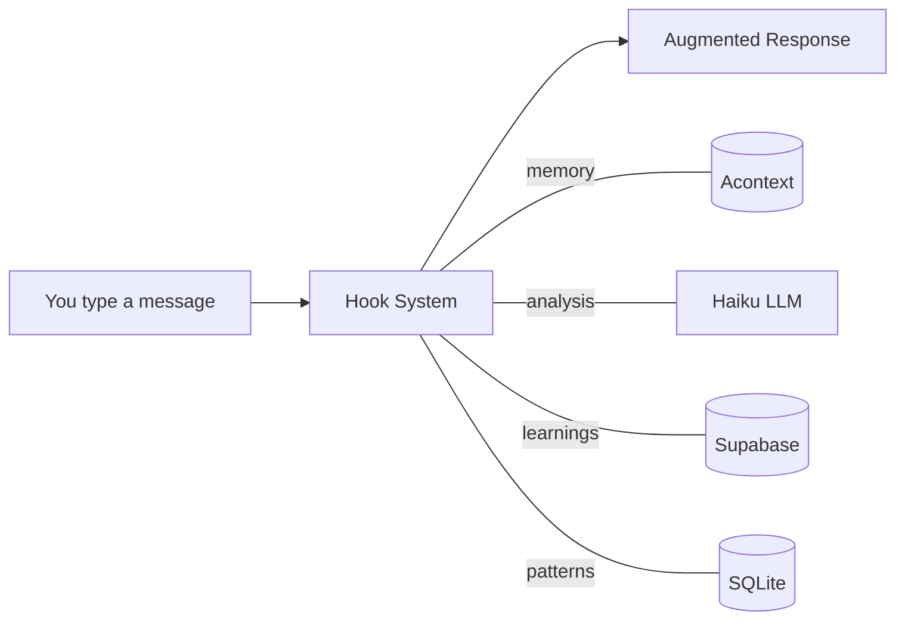

# Intelligence-First Claude Code Setup

Augments Claude Code with **persistent memory**, **behavioral intelligence**, and **cross-session learning**.

> Diagrams use [beautiful-mermaid](https://github.com/lukilabs/beautiful-mermaid) compatible Mermaid syntax

## How It Works



Every message passes through 4 intelligence layers before Claude responds. Each layer adds context that makes Claude smarter.

## Documentation

| Doc | What it covers |
|-----|---------------|
| [Architecture](docs/architecture.md) | System overview, file structure, setup |
| [Hook Lifecycle](docs/hook-lifecycle.md) | What happens at each hook event |
| [SDK Integrations](docs/sdk-integrations.md) | Acontext, Anthropic, Supabase connections |
| [Learning Loop](docs/learning-loop.md) | How mistakes become learnings via Praxis Engine |
| [Agents](docs/agents.md) | 5 custom agents and when to use them |
| [Analyzer](docs/analyzer.md) | Consolidated LLM analysis (before/after) |

## Quick Setup

```bash
# 1. Copy the reusable components
cp -R agents commands docs hooks tools ~/.claude/

# 2. Review and merge settings.json into your existing settings

# 3. Add your API keys
cp settings.local.json.template settings.local.json
# Edit settings.local.json with your keys

# 4. Install dependencies
pip install acontext anthropic
chmod +x hooks/*.sh
```

The included settings do not grant wildcard tool permissions or disable the Claude Code sandbox. The security gate adds targeted `deny` or `ask` decisions for known command and sensitive-file patterns; it is not a complete policy engine.

## Required Services

| Service | Purpose |
|---------|---------|
| [Acontext](https://acontext.app) | Session memory across conversations |
| [Anthropic](https://anthropic.com) | Haiku LLM for classification |
| [Supabase](https://supabase.co) | Learning storage via [Praxis Engine](https://github.com/pkmdev-sec/praxis-engine) |
