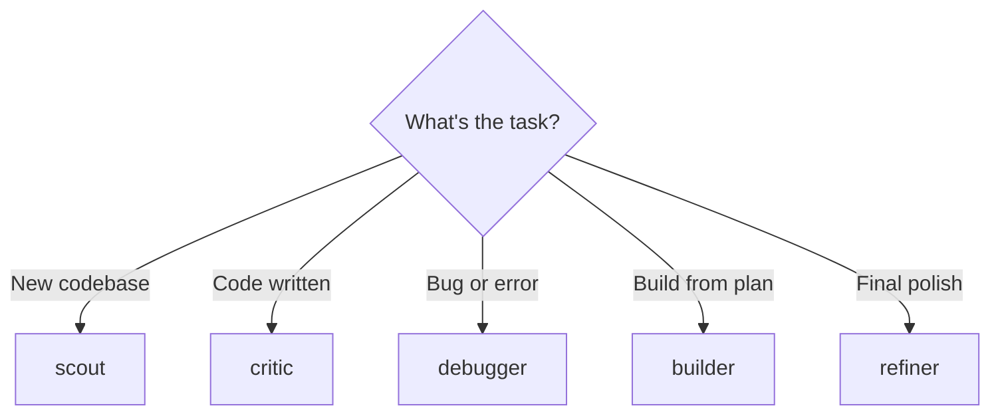
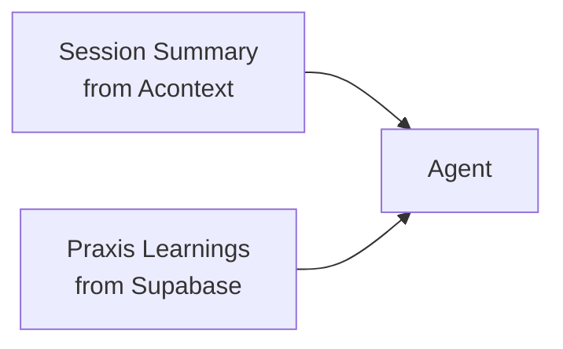
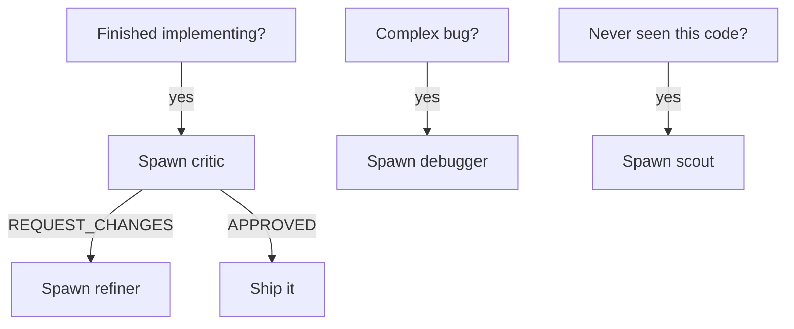

# Agents

Five custom agents, each specialized for a different task type.

## When to Use Which

## Agent Details

| Agent | Model | Turns | Purpose |
|-------|-------|-------|---------|
| **scout** | sonnet 1m | 16 | Discovery and planning — explores unfamiliar codebases |
| **critic** | opus 1m | 18 | Adversarial review — finds bugs you can't find in your own work |
| **debugger** | opus 1m | 20 | Root cause analysis — traces execution flow, uses Reflexion pattern |
| **builder** | opus 1m | 30 | Implementation — executes plans phase by phase with verification |
| **refiner** | sonnet 1m | 10 | Quality convergence — bounded loop: score, critique, rewrite, rescore |

## What Every Agent Receives

Every subagent gets context injected via the `SubagentStart` hook:

During execution, agents also receive **file-level behavioral warnings** via the `PreToolUse` hook when they read or edit files.

## Decision Guide

**Default: work directly.** Only spawn agents when they add specific value.

- **critic** is the highest-value agent — catches bugs in your own work
- **debugger** uses Reflexion pattern with memory of past root causes
- **scout** only for unfamiliar codebases — session memory covers known projects
- **refiner** only when critic returns REQUEST_CHANGES
