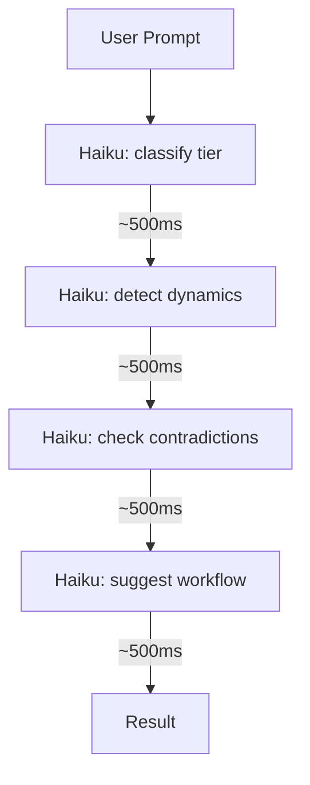
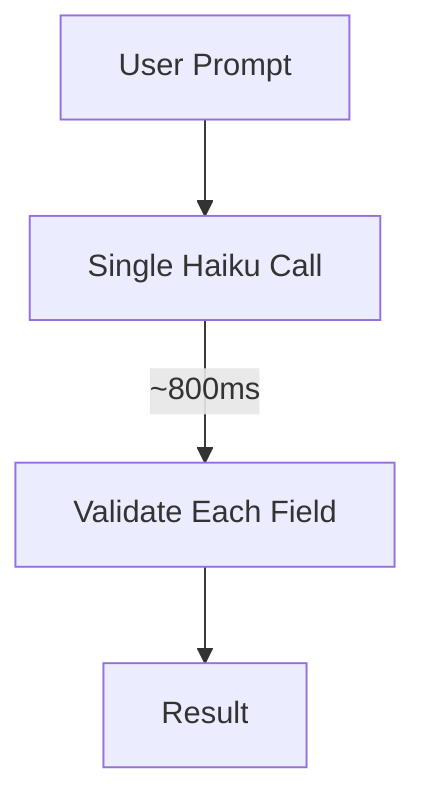
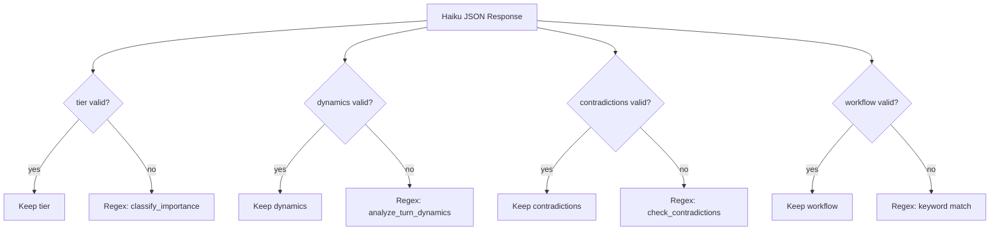
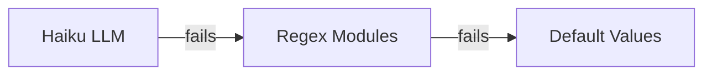

# Consolidated Analyzer

Replaced 4 separate Haiku API calls with 1 consolidated call per message.

## Before vs After

### Before: 4 Sequential Calls



**Total: ~2-3s, ~$0.01 per message**

### After: 1 Consolidated Call



**Total: ~0.8s, ~$0.003 per message — 75% cheaper, 70% faster**

## What the Single Call Returns

```json
{
  "tier": 0,
  "category": "decision",
  "entities": ["PostgreSQL", "MongoDB"],
  "dynamics": [{"type": "redirect", "fact": "...", "confidence": 0.9}],
  "contradictions": [{"type": "replacement", "old": "...", "new": "..."}],
  "workflow": "substantial"
}
```

## Per-Field Validation

Each field is validated independently. If one field is bad, only that field falls back to regex:



## Fallback Chain



- **Haiku available:** Full LLM analysis (~800ms)
- **Haiku unavailable:** Regex modules from legacy system (<50ms)
- **Everything fails:** Safe defaults (tier=2, workflow=medium)

## Performance

| Metric | Before | After |
|--------|--------|-------|
| Haiku calls/message | 3-4 | 1 |
| Latency | ~2-3s | ~0.8s |
| Cost/message | ~$0.01 | ~$0.003 |
| Timeout | none | 8s |
