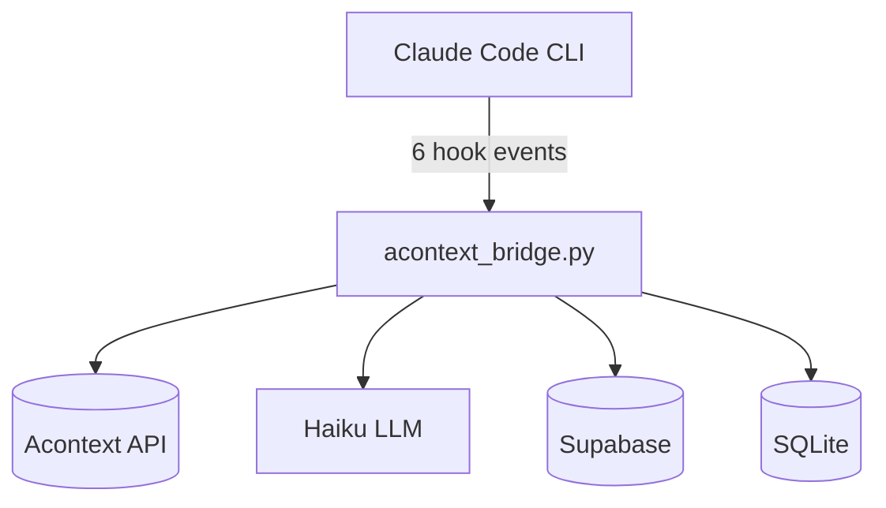
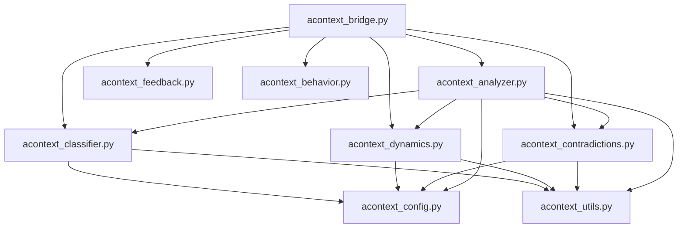
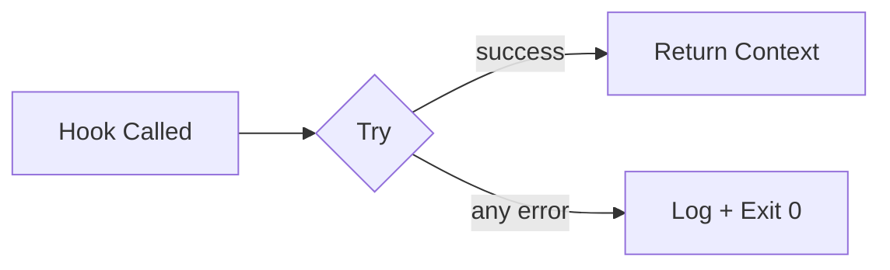

# Architecture

## System Overview



The bridge is the single entry point. It dispatches each hook event to the appropriate handler and coordinates all external service calls.

## File Structure

```
~/.claude/
├── settings.json                  # Hook wiring + model config
├── settings.local.json            # API keys (gitignored)
├── CLAUDE.md                      # System instructions
│
├── hooks/                         # Intelligence engine
│   ├── acontext_bridge.py         # Main dispatcher
│   ├── acontext_analyzer.py       # Consolidated LLM analysis
│   ├── acontext_behavior.py       # SQLite behavioral store
│   ├── acontext_dynamics.py       # Turn dynamics detection
│   ├── acontext_contradictions.py # Contradiction detection
│   ├── acontext_feedback.py       # Feedback tracking
│   ├── acontext_classifier.py     # Tier classification
│   ├── acontext_utils.py          # Shared utilities
│   ├── acontext_config.py         # Shared config
│   ├── learning_hook.py           # Learning extraction
│   └── security_gate.py           # Command filter
│
├── agents/                        # Custom agent definitions
│   ├── scout.md
│   ├── critic.md
│   ├── debugger.md
│   ├── builder.md
│   └── refiner.md
│
├── tools/
│   └── learning-loop/
│       └── extract_learning.py    # Praxis learning generator
│
└── commands/                      # 12 custom slash commands
```

## Module Dependencies



All modules import from `config` (constants) and `utils` (Haiku client, JSON parsing). The bridge imports everything. The analyzer imports the legacy modules as regex fallbacks.

## Key Design Principle

Every hook exits 0 on failure. Hooks never crash Claude Code:


