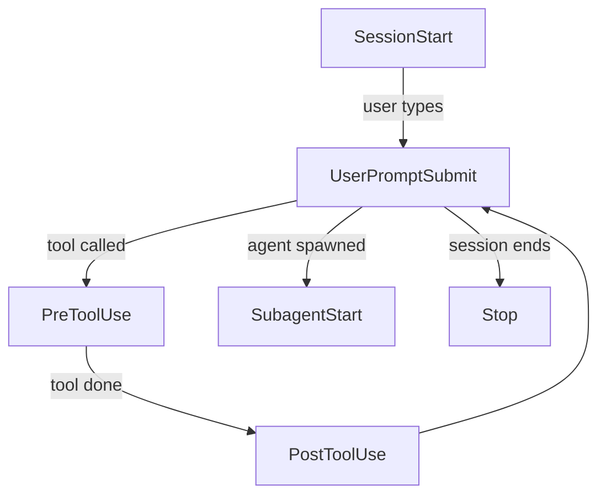
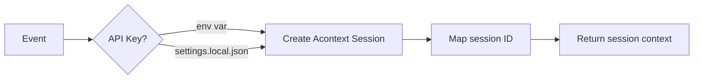
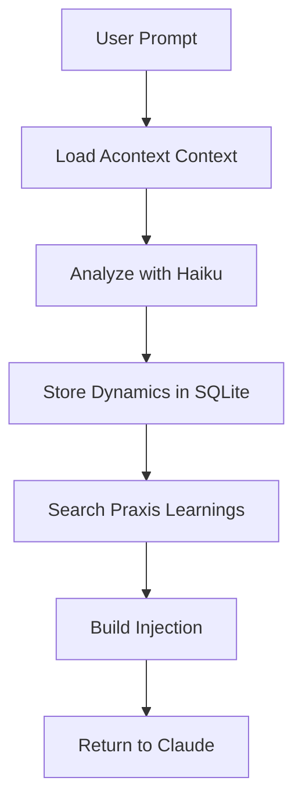
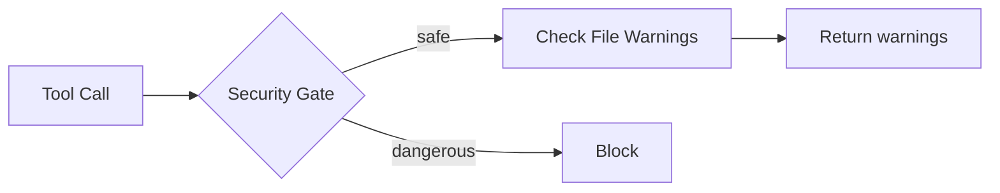
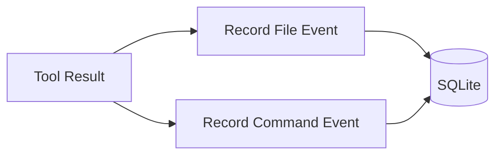
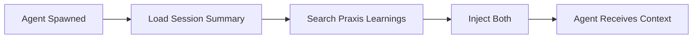
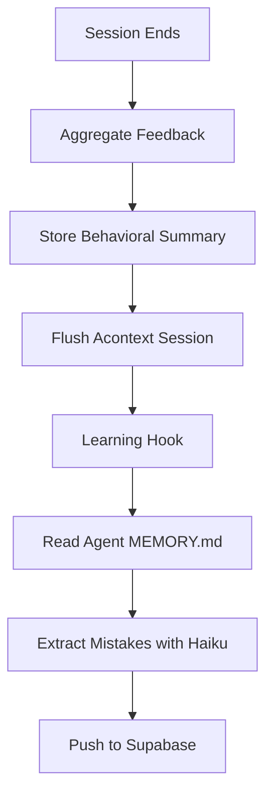

# Hook Lifecycle

Six hooks fire at different points in a Claude Code session.

## Event Order

## What Each Hook Does

### SessionStart

Creates or resumes an Acontext session. Loads API key from environment, falls back to `settings.local.json`.

### UserPromptSubmit

The most complex hook — runs on every user message:

**What gets injected:**
- Session memory (recent conversation context)
- Contradiction warnings (if message conflicts with stored decisions)
- Praxis learnings (WHEN/SCAN/FIX/NOT from past mistakes)
- Workflow hints (bug → debugger, substantial → critic)

### PreToolUse

Runs the security gate (blocks dangerous bash commands) and injects file-level behavioral warnings from SQLite.

### PostToolUse

Silently records what happened — file reads/writes/edits and bash command success/failure. Builds the behavioral pattern database.

### SubagentStart

Gives subagents session context AND Praxis learnings relevant to their role (e.g., a debugger gets debugging learnings).

### Stop

Aggregates session data, stores behavioral summary, and runs the learning extraction loop.
