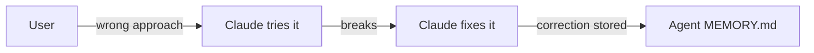
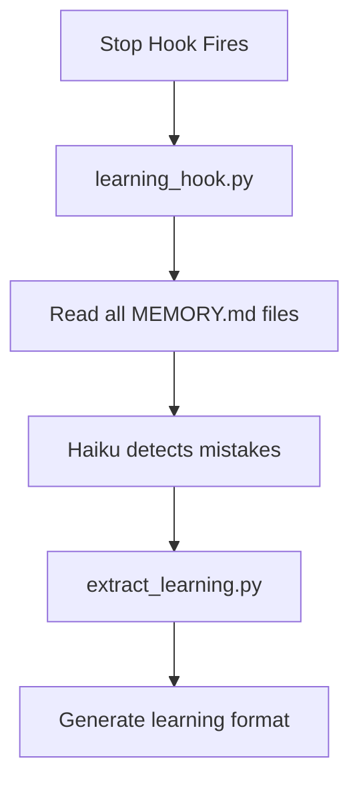
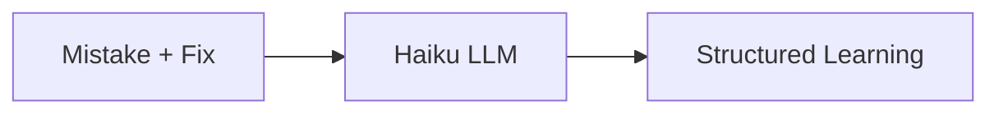
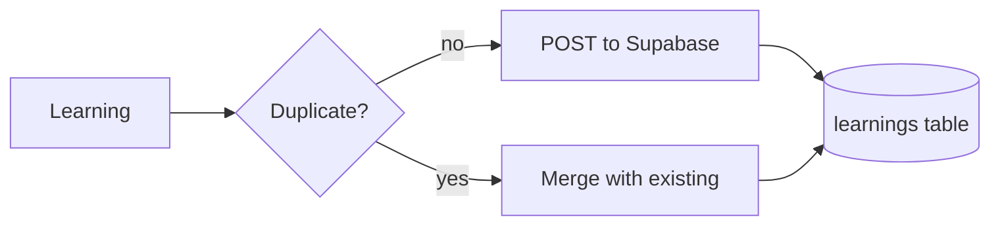
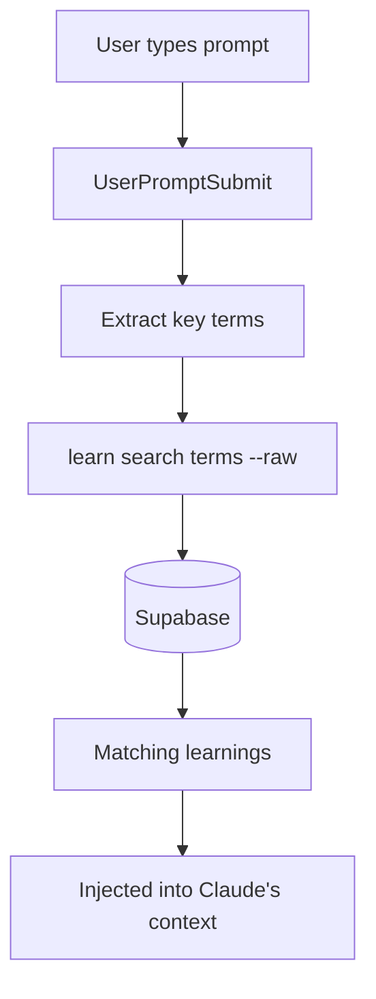
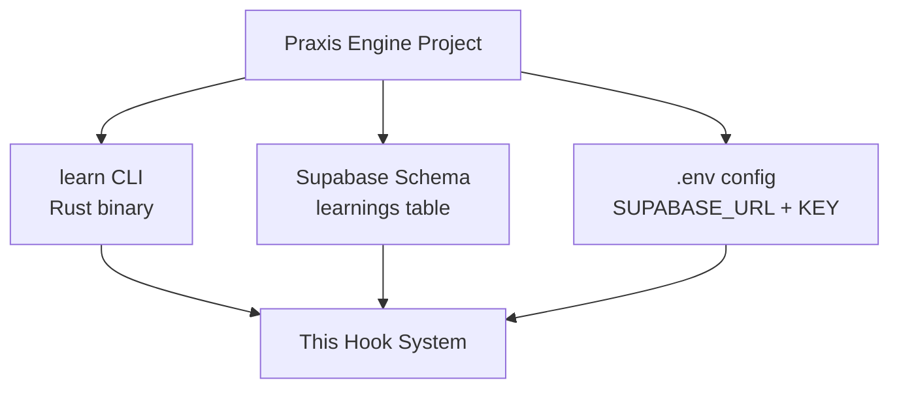

# Learning Loop

The system learns from mistakes and prevents them in future sessions. Built on the [Praxis Engine](https://github.com/pkmdev-sec/praxis-engine) project.

## The Cycle

### Step 1: Mistake Happens



During a session, mistakes get recorded in agent memory files at `~/.claude/agents/*/MEMORY.md`.

### Step 2: Session Ends — Extract Learning



The learning hook reads agent memory, uses Haiku to identify mistakes, and sends each to the extraction script.

### Step 3: Generate WHEN/SCAN/FIX/NOT Pattern



**Example output:**
```
WHEN: Encountering bugs, test failures, unexpected behavior
SCAN: Multiple fix attempts already tried, guessing at solutions
FIX: Read errors completely → reproduce consistently → form hypothesis → test minimal change
NOT: Fix before investigating | multiple changes at once | skip test creation
```

### Step 4: Store in Supabase



Duplicate detection uses similarity scoring. New learnings are pushed via REST API with `resolution=merge-duplicates`.

### Step 5: Next Session — Inject Learnings



The `learn` CLI (Rust binary) searches Supabase for learnings matching the current task. Results are injected alongside session memory and behavioral warnings.

**Also injected into subagents** — when a scout, critic, or debugger spawns, it receives learnings relevant to its role.

## The Praxis Engine Connection

This system uses the [Praxis Engine](https://github.com/pkmdev-sec/praxis-engine) — a separate project that provides:



- **`learn` CLI** — installed at `~/.cargo/bin/learn`, used for search + push
- **Supabase table** — `learnings` with columns: slug, name, content, domains, triggers
- **Environment** — `~/praxis-engine/.env` provides Supabase credentials

The hook system is a **consumer** of the Praxis Engine. It reads learnings during sessions and writes new learnings on session end.
