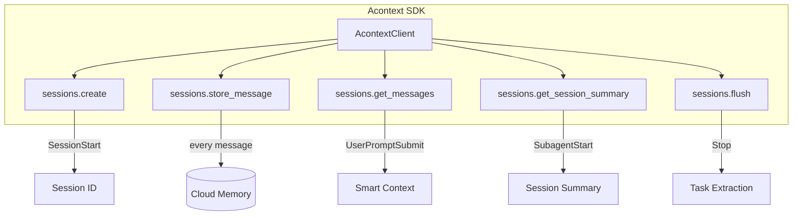
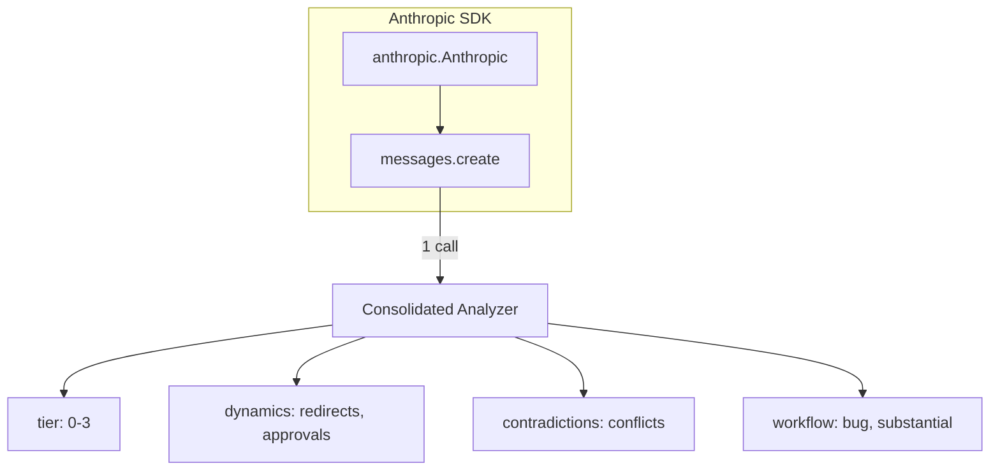
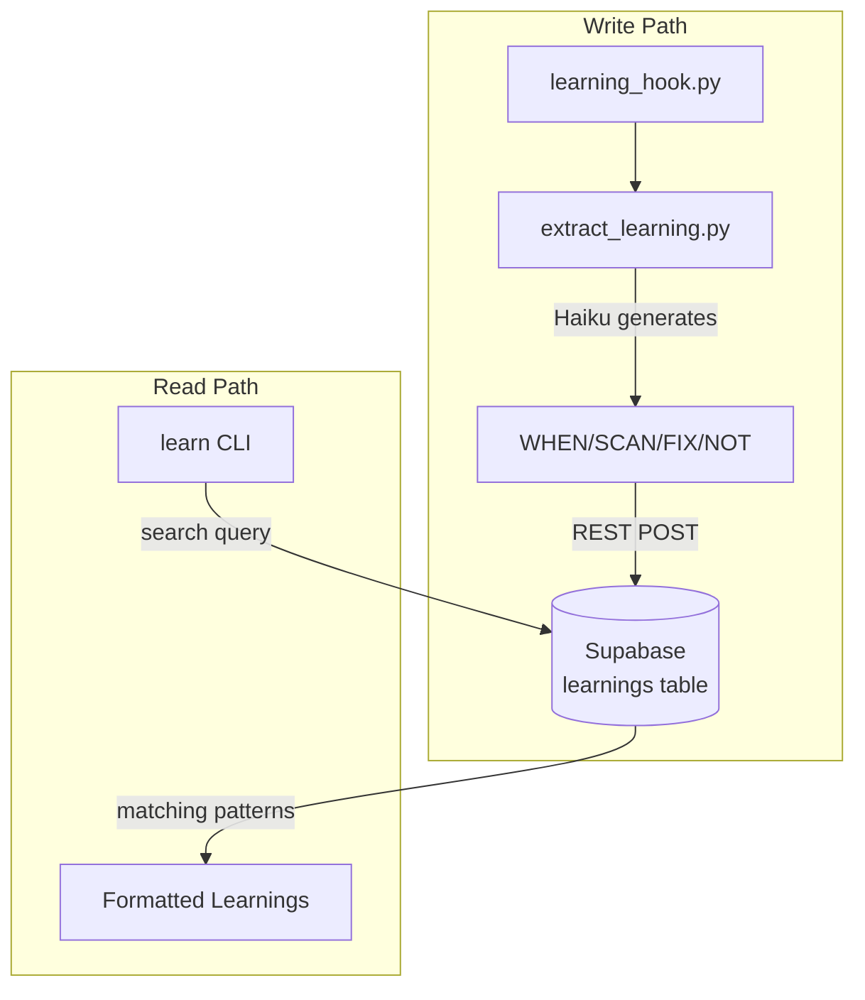
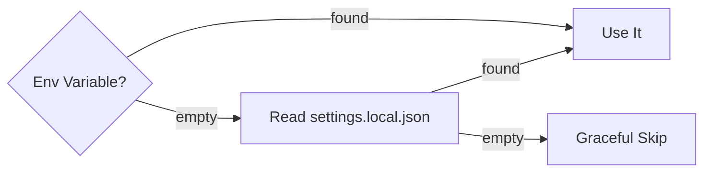

# SDK Integrations

Three external services connected through their respective SDKs.

## Acontext SDK (Session Memory)

**How it connects:**
- Package: `acontext` (Python SDK)
- Auth: `ACONTEXT_API_KEY` from env or `settings.local.json`
- Base URL: `https://api.acontext.app/api/v1`
- Used by: `acontext_bridge.py` (all 6 hooks)

**Smart Context** uses edit strategies to compress history:
- `remove_tool_result` — keeps only 3 recent tool results
- `token_limit` — caps at 8,000 tokens

## Anthropic SDK (Haiku LLM)

**How it connects:**
- Package: `anthropic` (Python SDK)
- Auth: `ANTHROPIC_API_KEY` from env or `settings.local.json`
- Model: `claude-haiku-4-5`
- Timeout: 8 seconds
- Used by: `acontext_analyzer.py` (primary), `acontext_classifier.py`, `acontext_dynamics.py`, `acontext_contradictions.py` (fallback)

**One call replaces four.** The consolidated analyzer sends one prompt that returns all classification fields in a single JSON response.

## Supabase via Praxis Engine (Learning Storage)

**How it connects:**
- CLI: `~/.cargo/bin/learn` (Rust binary from [Praxis Engine](https://github.com/pkmdev-sec/praxis-engine))
- Auth: `SUPABASE_URL` + `SUPABASE_ANON_KEY` from `~/praxis-engine/.env` or `settings.local.json`
- Write: REST API with `resolution=merge-duplicates`
- Read: `learn search <query> --raw`
- Used by: `acontext_bridge.py` (UserPromptSubmit + SubagentStart)

## Credential Loading

All three services use the same dual-source pattern:

This ensures hooks work even when subprocesses don't inherit environment variables.
